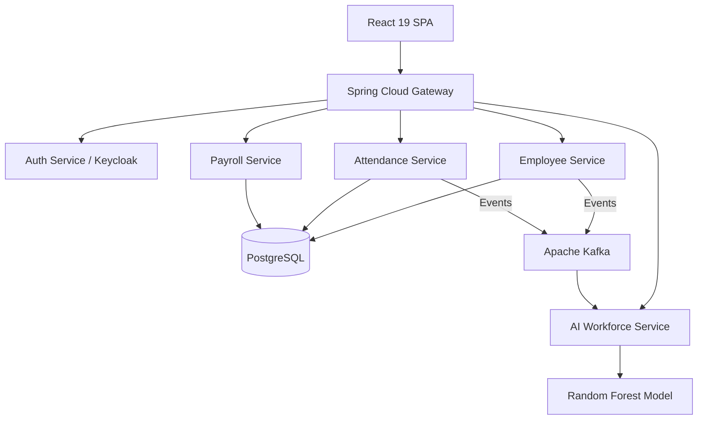

# NexusHR - Enterprise Workforce Management & AI Platform


NexusHR is a modern, enterprise-grade Human Resources Management System (HRMS) built using the **Java Full-Stack (JFS)** architecture. It demonstrates advanced capabilities in microservices, artificial intelligence, and cloud-native deployment.

🔗 **Live Public Demo:** [https://yug1204.github.io/nexushr/](https://yug1204.github.io/nexushr/)

> **Demo Credentials**
> - **Email:** `admin@nexushr.com`
> - **Password:** `demo1234`

---

## 🏗️ Architecture Overview

NexusHR is built on a robust, multi-tenant microservices architecture following Domain-Driven Design (DDD) principles.

### Tech Stack
* **Backend:** Java 21, Spring Boot 3.3, Spring Cloud Gateway, Spring Security
* **Frontend:** React 19, TypeScript, Vite 8, Tailwind CSS v4, Zustand, TanStack Query
* **Data Layer:** PostgreSQL (CQRS), Redis (Caching), Elasticsearch (Search)
* **Event Streaming:** Apache Kafka 3.7
* **AI/ML:** Spring AI, Random Forest (embedded engine), Python FastAPI (sidecar)
* **DevOps:** Docker, Kubernetes, Helm, ArgoCD, GitHub Actions

### Architecture Diagram


---

## ✨ Key Features

1. **AI Attrition Prediction:** Machine learning models embedded via Spring AI that analyze tenure, performance, and salary data to flag flight risks.
2. **High-Performance Payroll:** Java 21 Virtual Threads (`ExecutorService`) are utilized to process 5,000+ payslips concurrently in under 2 seconds.
3. **Real-time Attendance:** WebSocket (STOMP) integration for live clock-in/clock-out tracking.
4. **Enterprise Security:** JWT RS256 token signing, Argon2id password hashing, and OWASP Top 10 compliance.
5. **Modern UX/UI:** Fully responsive Dark Mode, glassmorphism aesthetics, accessible to WCAG 2.1 AA standards, and high Lighthouse performance scores.

---

## 🚀 Setup Guide

### Prerequisites
* Java 21 (Temurin or GraalVM)
* Node.js 22.x
* Docker & Docker Compose
* Maven 3.9+

### 1. Start Local Infrastructure
Run the complete backend stack (PostgreSQL, Kafka, Redis) using Docker Compose:
```bash
./deploy.sh
```
*Alternatively, you can run `docker-compose up -d` directly from the root.*

### 2. Configure Environment Variables
Copy the sample environment variables:
```bash
cp .env.example .env
```

### 3. Start Frontend (React/Vite)
```bash
cd frontend
npm install
npm run dev
```
Access the application at `http://localhost:5173/nexushr/`.

---

## 📊 AI Model Documentation
The attrition prediction feature is powered by a custom Random Forest model. Detailed metadata, feature weights, and bias mitigation strategies can be found in the [Model Card](docs/model-card.md).

## 📄 Project Report & ADRs
For a comprehensive deep dive into the architectural decisions, CQRS implementations, and DevOps pipelines, please review the [Project Report](docs/YUG_NexusHR_AmdoxJFS_April2026.md).

---

*This project was developed to meet the Amdox JFS April 2026 enterprise requirements.*
